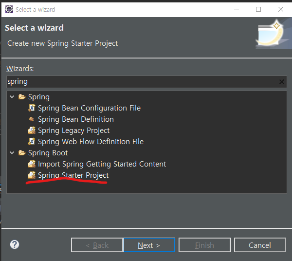
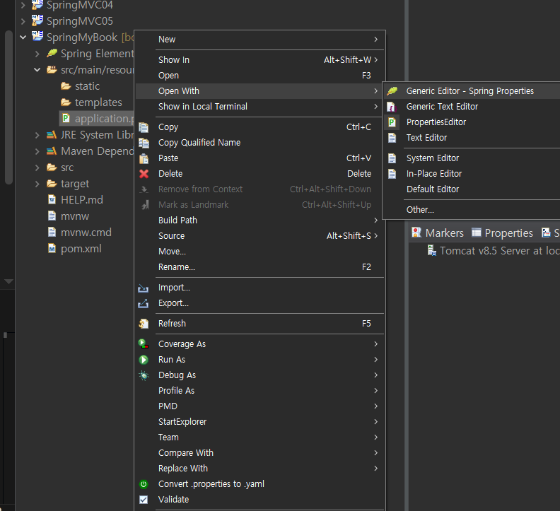
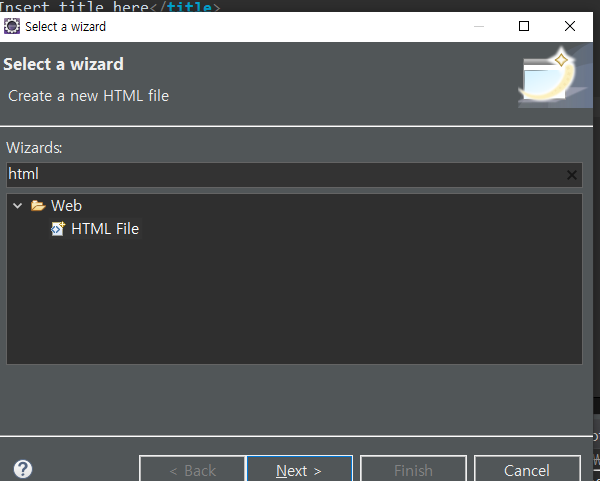
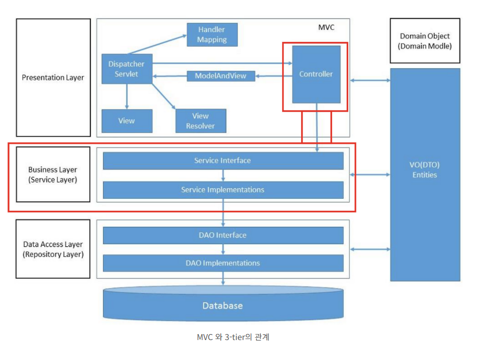

## Spring boot
- 장점
  - 버전 관리가 필요 없다
  - 환경설정이 쉽다

</br>

### 만드는 법

- new -> other -> spring boot -> spring starter project

</br>



</br>


- Spring Boot DevTools 
  - 추가한 프로젝트는 vscode에서 사용불가 


</br>

- spring 3.5.5 부터는 자바 17버전 이상 사용해야됨(17 안쓰는 이유 : 기업에서 쓰면 유료라서)


</br>
</br>
</br>

### 설정법
- 모든 설정은 application.properties에서 함

</br>


</br>
  


- 띄어쓰기 금지


#### Tomcat Server Port 번호 설정
- http 웹 기본 포트는 8080 오라클 기본 포트도 8080 이라 보통 바꿈
- server.port=8086

</br>
</br>

#### DB 설정

```
spring.datasource.driver-class-name=com.mysql.cj.jdbc.Driver
spring.datasource.url=jdbc:mysql://localhost:3306/com
spring.datasource.username=com
spring.datasource.password=com01
```
</br>
</br>

#### Context Path 작성
#### localhost:8086/myBook
```
server.servlet.context-path=/myBook
```

#JPA 설정
#MySQL 상세지정
spring.jpa.database-platform=org.hibernate.dialect.MySQL5InnoDBDialect
#스키마 생성(create, update) -> create 테이블 -> 계속 삭제 후 재 생성 update -> 내용 업데이트 
spring.jpa.hibernate.ddl-auto=create 
#실행되는 SQL문을 보여주기
spring.jpa.show-sql=true
#실제 JPA 구현체인 Hibernate가 동작하면서 만들어낸 SQL문장을 출력하기
spring.jpa.properties.hibernate.format-sql=true

MySQL5InnoDBDialect -> 5버전 쓰고 있다


- Thymeleaf 
  - 쓰는 이유 : 무거운 jsp를 가벼운 html로 쓸수 있고 명령어가 쉽다
  

### 사용법
#### main html 만들기
- src/main -> templates 에서 new other -> html



스프링 숫자형 = Long

@Id 프라이머리키 생성

@Column(length = 2000) 글자 길이조절 (기본은 255)

@Column(columnDefinition = "int default 0") 디폴트값 설정



### 서비스 인터페이스
- OoooService 라는 이름으로 만듬

### 서비스 클래스
- OoooServicempl 이름으로 만듬
- 인터페이스 구현할거면implements 키워드 사용

### 타임리스트
- 태그안에 사용
ex) <tr th:each="vo : ${list}">