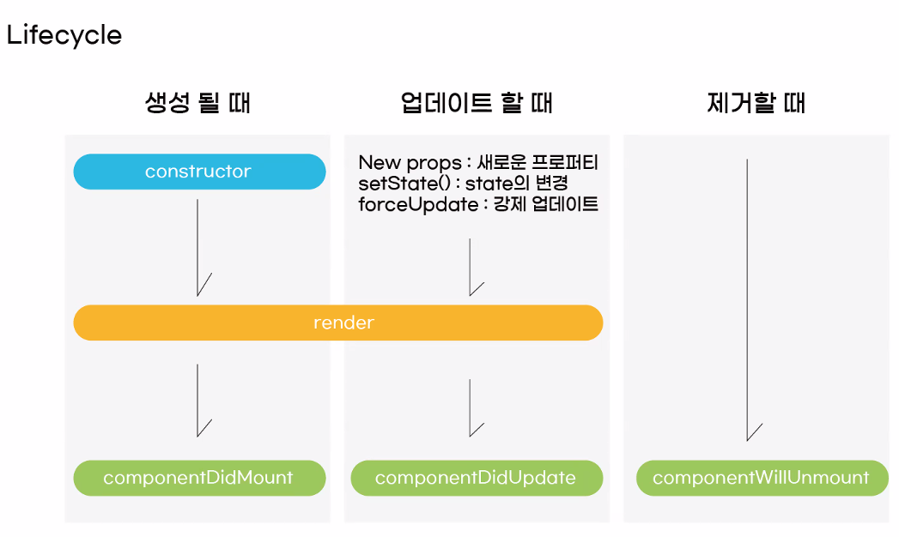

## 리액트

### 리액트란?
- 자바스크립트 라이브러리 중 하나 사용자의 인터페이스를 만들기 위해 사용

</br>

### 리액트를 쓰는 이유 
- 리액트 없이 쓰면 HTML과 JS가 가진 분리감 때문에 불편함
- 관련있는 HTML, JS문서들을 JSX으로 합쳐준다
- 직관적이지만 너무 긴 자바스크립트 문법
- 새 페이지를 들어갈 때 마다 새로고침
- 많이 쓴다

</br>

### 라이브러리 vs 프레임워크
- 라이브러리 : 기능만 가져다 사용하는 것
- 프레임워크 : 제공된 틀 안으로 들어가 주어진 규칙을 지켜가며   사용하는 것

## JSX
    - 하나의 파일 안에 HTML문법과 JS문법을 동시에 작성
	 가독성이 좋고, 작성이 쉽다
	- HTML과 JS의 분리감이 적다

	JSX는 확장자가 기본적으로 .jsx이지만 .js로도 사용이 가능

    {} 내부에 js 표현식 사용 가능
    jsx 내부에서는 js 표현식이 가능하다
    단, 표현식 냅무에서 if문(statement)사용 불가능! -> 삼항연산자로 대체 가능!


## 구조분해(비구조화)할당

-  const [a,b] = [1,3];
-  // a == 1, b == 3


const {name, age} = {
    name : "장원영",
    age : 20
}
// name == 장원영, age == 20

props안에? {menu: "민트초코", price: 4000}
const {menu, price} = props


### map()함수

- 기존 배열을 새로운 배열로 만듬

```
let list = [1,2,3,4,5]
let resList = list.map(num=>num*2)
console.log(resList)
```

- 프록스를 통해 하위 요소에서 상위요소로 데이터 전달
부모요소에 FUNCTION 생성 -> 자식 요소에서 매개변수로 데이터 전달

### useRef
- 저장공간 또는 DOM요소에 접근하기 위해 사용하는 리액트 Hook
- Ref란 reference(참조)를 의미


### Lifecycle
- React Component에는 생명주기가 존재
- 컴포넌트가 실행되거나, 업데이트 되거나, 삭제 될 때 특정 이벤트가 발생함

- Mount : 화면에 첫 렌더링
- Update : 업데이트 후 다시 렌더링
- Unmount : 화면에서 사라짐



### 비동기 통신

- REST API(REpresentational State Transfer API)
  - 자원(Resources)을 주소 (URL)로 표시하고, HTTP 메소드로 행위를 표현하는 API
- 자원(Resources)
  - 데이터의 단위(테이블 이름)로 명사. 복수형으로 사용
- 행위(Verb)
  - 클라이언트가 서버의 자원에 대해 어떤 작업을 요청하는지를 나타냄
  - .HTTP Method로 표현
    - DELETE
    - GET
    - POST
    - PATCH 하나만 변경
    - PUT  그줄 전체가 변경
- fetch()
-  Client와 Server 사이에 데이터를 주고받기 위해 브라우저에서 제공하는 비동기 통신 함수
- axzios.method()
  - Client와 Server 사이에 데이터를 주고받기 위해 사용하는 외부 라이브러리 비동기 통신 함수

- await
  - 비동기 함수가 처리될 때까지 기다렸다가 다음 코드를 실행하게 해주는 키워드
  - 비동기 함수를 동기 함수처럼 작동하게 해준다
- async
  - 해당 함수가 비동기 작업을 포함하고 있음을 명시하기 위한 키워드
  - 함수의 선언 앞에 붙여서 사용(함수 내부에 await 키워드가 있는 경우)


### 라우터(Router)
- 사용자가 요청한 URL에 따라 해당 URL에 맞는 페이지를 보여주는 것

</br>

#### React Router 설치
 npm i react-router-dom

</br>

#### Link Component
- a태그는 클릭 시 새로운 페이지를 불러오기 때문에 Link 컴포넌트를 대신 사용한다
- HistoryAPI를 통해 브라우저 주소의 경로만 바꾸는 역할