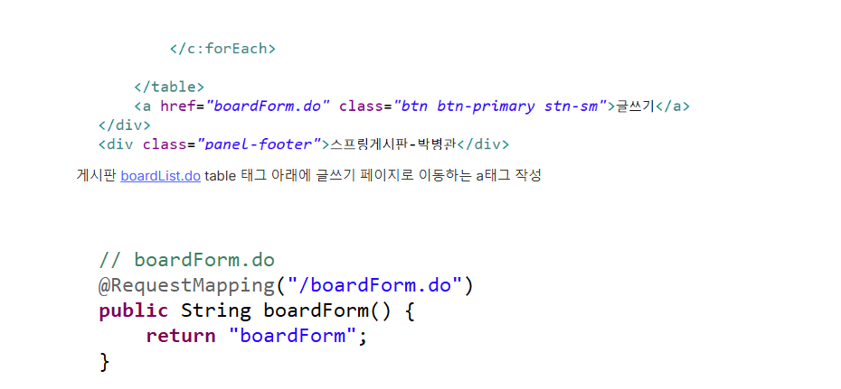
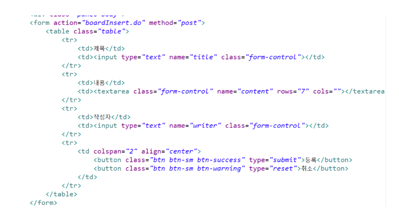
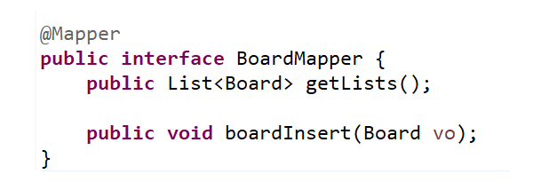
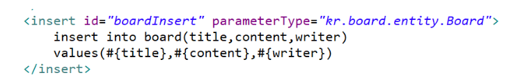

## TIL 2025-08-01

### 오늘 배운 것
글쓰기 기능


BoardController에 boardForm.do url맵핑 추가


Controller에 boardInsert 기능 추가

Mapper Interface에 메소드 추가

한글 인코딩
```jsp
<filter> 
    <filter-name>encodingFilter</filter-name> 
    <filter-class>org.springframework.web.filter.CharacterEncodingFilter</filter-class> 
    <init-param> 
       <param-name>encoding</param-name> 
       <param-value>UTF-8</param-value> 
    </init-param> 
    <init-param> 
       <param-name>forceEncoding</param-name> 
       <param-value>true</param-value> 
    </init-param> 
 </filter> 
 <filter-mapping> 
    <filter-name>encodingFilter</filter-name> 
    <url-pattern>/*</url-pattern> 
 </filter-mapping> 
 ```