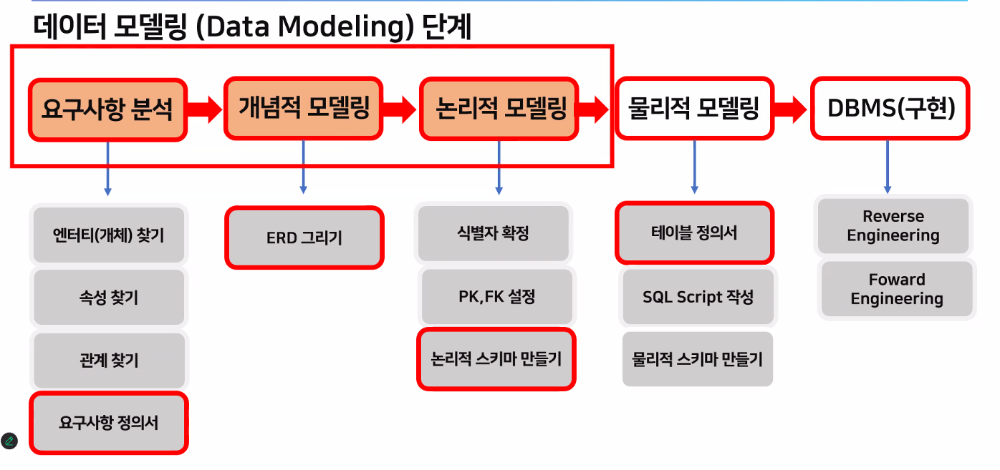

효율적인 데이터 관리를 위한 조건
- 데이터를 통합하여 관리
- 일관된 방법으로 관리
- 데이터 누락 및 중복 제거
- 여러 사용자(응용프로그램 포함)가 공동으로 실시간 사용 가능
### 데이터 모델링(Data Modeling) 이란?
- 데이터 모델은 현실 대상을 데이터로 저장하고 활용하기 위한 설계도 이다
- 데이터 모델링은 이러한 데이터 모델을 설계하는 과정으로 어디에 어떤 데이터를 저장할지 고민하고 설계하는 절차를 의미한다
### 데이터 모델링 단계

### 올바른 데이터 모델링
- 현업 요구사항과 비즈니스 규칙이 반영되어야 한다.
  - 업무에서 요구하는 흐름과 규칙이 데이터 설계에 반영 되어야 한다.
- 데이터 중복을 피하고 재사용이 가능해야 한다
  - 한곳에 저장된 데이터를 여러 업무에서 함계 사용하는 구조로 설계해야 한다
- 업무 관련자 간 의사소통이 쉬어야 한다
  - 데이터 모델을 보고 누구나 쉽게 업무 구조를 이해하고 의견을 나눌 수 있어야 한다.
- 데이터가 일관적이고 유연해야 한다
  - 같은 상황에서 항상 같은 방식으로 저장되고, 변화에도 쉽게 대응할 수 있어야 한다. 